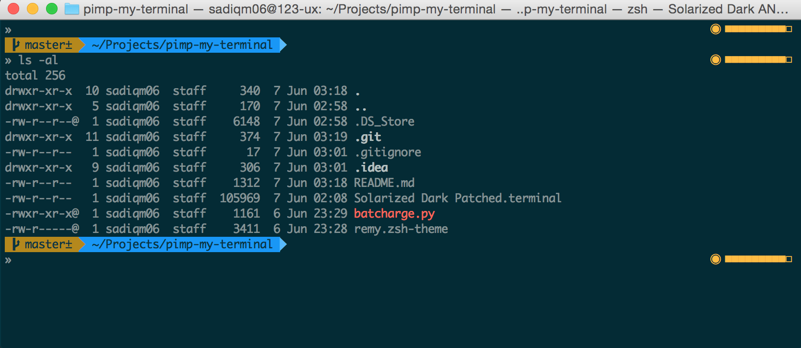

#Pimp My Terminal



1. Install oh-my-zsh

```
curl -L https://raw.github.com/robbyrussell/oh-my-zsh/master/tools/install.sh | sh
```

2. Import Solarized theme into terminal. Open terminal preference -> profile -> import -> select theme from and make it default

3. Download remy.zsh-theme and copy that into zsh theme folder.

```
mv remy.zsh-theme ~/.oh-my-zsh/theme/
```

4. Open zsh config and enable remy theme

```
nano ~/.zshrc
```

```
ZSH_THEME="remy"
```

5. Copy batcharge.py into $HOME/bin folder (if bin doesn't then exist create it)
 
6. change batcharge.py permission to 755

```
chmod 755 batcharge.py
```

7. restart terminal app.

###Patched Solarized Theme for OSX terminal (yosemite compatible)


##Credits
Thanks Remy for inspiring
https://remysharp.com/2013/07/25/my-terminal-setup

Thank you for creating original battery percentage script
http://stevelosh.com/blog/2010/02/my-extravagant-zsh-prompt/

Creators and contributed of Oh-My-ZSH
http://ohmyz.sh/

Creator of Solarized Theme for OSX terminal
http://ethanschoonover.com/solarized

Creator of agnoster theme for ZSH
https://gist.github.com/agnoster/3712874

Poswerline fonts
https://gist.github.com/qrush/1595572
https://github.com/Lokaltog/powerline-fonts
